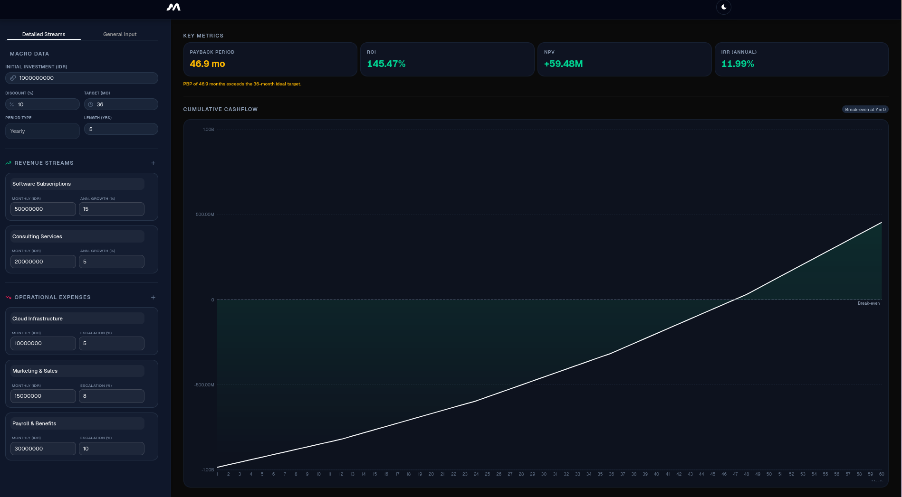

# Metrica — Financial Metric Visualizer
<div style="display: flex; gap: 10px;">


</div>

**Metrica** is a modern, client-side financial projection tool built with Next.js. It lets users model revenue streams, operating expenses, and investment parameters — then instantly visualizes key financial metrics (PBP, ROI, NPV, IRR) along with an interactive cashflow chart. All calculations run reactively in the browser with zero backend required.


---

## ✨ Features

- **Dual Input Modes** — Switch between **Detailed** mode (itemized revenue & OPEX streams with compounding growth) and **General** mode (manual period-by-period cashflow entry).
- **Real-Time Financial Metrics** — Automatically computes Payback Period (PBP), Return on Investment (ROI), Net Present Value (NPV), and Internal Rate of Return (IRR) as inputs change.
- **Interactive Cashflow Chart** — Visualizes net cashflow projections using Recharts with custom tooltips and responsive layout.
- **Compounding Growth Engine** — Revenue and OPEX streams compound annually based on user-defined growth/escalation rates over a configurable projection length.
- **Safe IRR Calculation** — Uses a bisection-based Newton-Raphson solver with guard-rails to prevent runtime errors on edge-case inputs.
- **Dark / Light Theme** — Smooth animated theme toggle with persistent preference via `next-themes`.
- **Form Validation** — Zod-powered schema validation with React Hook Form for type-safe, reactive input handling.
- **Global State Management** — Zustand store with sample data preloading and one-click reset.
- **Compact Currency Formatting** — Human-readable financial values (e.g., `1.50B`, `250.00M`, `12.5K`).
- **Responsive Layout** — Split-panel dashboard that adapts from stacked mobile view to side-by-side desktop layout.

---

## 🏗️ Project Structure

```
metrica/
├── app/
│   ├── globals.css          # Global styles & design tokens
│   ├── layout.tsx           # Root layout, fonts, theme provider, SEO metadata
│   └── page.tsx             # Main dashboard page (Topbar + LeftPanel + RightPanel)
│
├── components/
│   ├── dashboard/
│   │   ├── left-panel/      # Input forms: mode selector, macro inputs, streams, cashflows
│   │   └── right-panel/     # Output display: metric cards, cashflow chart
│   ├── layout/              # Topbar, theme provider
│   └── ui/                  # Reusable primitives (Button, Input, Tabs, Separator, etc.)
│
├── lib/
│   ├── calculations.ts      # Core financial engine (PBP, ROI, NPV, IRR)
│   ├── format.ts            # Currency, percentage, and PBP formatters
│   ├── types.ts             # Zod schemas & TypeScript types
│   ├── utils.ts             # General utilities (cn helper)
│   ├── hooks/               # Custom React hooks (useFinancialData)
│   └── store/               # Zustand state management (useProjectStore)
│
├── public/                  # Static assets (favicon, logo, preview image)
├── package.json
├── tsconfig.json
└── next.config.ts
```

---

## 🚀 Getting Started

### Prerequisites

- **Node.js** ≥ 18
- **npm** (bundled with Node.js)

### Installation

```bash
# 1. Clone the repository
git clone https://github.com/your-username/metrica.git
cd metrica

# 2. Install dependencies
npm install

# 3. Start the development server
npm run dev
```

Open [http://localhost:3000](http://localhost:3000) in your browser.

### Build for Production

```bash
npm run build
npm start
```

---

## 🛠️ Tech Stack

| Layer | Technology |
|---|---|
| Framework | Next.js 16 (App Router) |
| Language | TypeScript 5 |
| Styling | Tailwind CSS 4 |
| Charts | Recharts 3 |
| Forms | React Hook Form + Zod |
| State | Zustand |
| UI Components | Radix UI + shadcn/ui |
| Animations | Framer Motion |
| Theming | next-themes |

---

## 📄 License

This project is licensed under the MIT License.
See the [LICENSE](LICENSE) file for details.